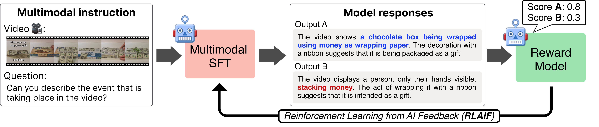

# 🤖 VLM-RLAIF (ACL'24 Oral)
> [**Tuning Large Multimodal Models for Videos using Reinforcement Learning from AI Feedback**](https://dcahn12.github.io/projects/vlm-rlaif/),            
[Daechul Ahn](https://dcahn12.github.io)<sup>1,3</sup>,
[Yura Choi](https://yuuraa.github.io)<sup>1,3</sup>,
[Youngjae Yu](https://yj-yu.github.io/home/)<sup>1</sup>, 
[Dongyeop Kang](https://dykang.github.io)<sup>2</sup>,
[Jonghyun Choi](https://ppolon.github.io)<sup>3,&dagger;</sup><br>
<sup>1</sup>Yonsei University,
<sup>2</sup>University of Minnesota,
<sup>3</sup>Seoul National University<br>
<sup>&dagger;</sup>Corresponding Author<br>
[ACL 2024](https://2024.aclweb.org) (To appear)

[](https://huggingface.co/SNUMPR/vlm_rlaif_video_llava_7b)
[](https://huggingface.co/SNUMPR/vlm_sft_video_llava_7b)
[](https://arxiv.org/abs/2402.03746)

[](https://paperswithcode.com/sota/video-based-generative-performance?p=tuning-large-multimodal-models-for-videos)

&nbsp;

## 📣 News 
- [Aug 07, 2024] We update our trained lora checkpoint of reward model & policy model initialization to Hugginface 
- [Aug 06, 2024] Our model is available in HuggingFace Spaces!
- [Jul 16, 2024]  🎙️ **VLM-RLAIF** has been selected for ✨***oral presentation***✨ at **ACL 2024**! See you in Bangkok 🇹🇭
- [Jun 16, 2024] 🔥 Our next work on aligning large video multimodal model, **i-SRT**🚄, is now available
 [[arXiv](https://arxiv.org/pdf/2406.11280v1), [code](https://github.com/snumprlab/srt)]
- [May 31, 2024] 🥳 **VLM-RLAIF** is accepted to **ACL 2024** !

&nbsp;


## 👀 Overview
<!-- <details>
    <summary><b>Abstract</b></summary>
    <i>Recent advancements in large language models have influenced the development of video large multimodal models (VLMMs). Previous approaches for VLMMs involve Supervised Fine-Tuning (SFT) with instruction-tuned datasets, integrating LLM with visual encoders, and additional learnable parameters. Here, aligning video with text, and vice versa, remains a challenge, primarily due to the insufficient quality and quantity of multimodal instruction-tune data compared to that of text-only. This discrepancy often results in alignments that poorly ground the video content. To address this, we present a novel alignment strategy that employs a multimodal AI system equipped with Reinforcement Learning from AI Feedback (RLAIF), providing self-preference feedback to refine itself and facilitating the alignment of video and text modalities. Our approach uniquely integrates detailed video descriptions as context into a multimodal AI system during preference feedback generation to enrich the understanding of video content, a process we call context-aware reward modeling. Empirical evaluations on various video benchmarks demonstrate that our VLM-RLAIF outperforms existing approaches, including the SFT model.</i>
</details> -->
> **Abstract:** *Recent advancements in large language models have influenced the development of video large multimodal models (VLMMs). Previous approaches for VLMMs involve Supervised Fine-Tuning (SFT) with instruction-tuned datasets, integrating LLM with visual encoders, and additional learnable parameters. Here, aligning video with text, and vice versa, remains a challenge, primarily due to the insufficient quality and quantity of multimodal instruction-tune data compared to that of text-only. This discrepancy often results in alignments that poorly ground the video content. To address this, we present a novel alignment strategy that employs a multimodal AI system equipped with Reinforcement Learning from AI Feedback (RLAIF), providing self-preference feedback to refine itself and facilitating the alignment of video and text modalities. Our approach uniquely integrates detailed video descriptions as context into a multimodal AI system during preference feedback generation to enrich the understanding of video content, a process we call context-aware reward modeling. Empirical evaluations on various video benchmarks demonstrate that our VLM-RLAIF outperforms existing approaches, including the SFT model.*

<div align="center">
    
<p>Pipeline of VLM-RLAIF</p>
</div>


## 🗃️ Dataset and Checkpoints
> Check [PREPARE_DATASET.md](./PREPARE_DATASET.md) to prepare training & validation datasets

| Model | Size | Checkpoint | corr. | detail. | context | temp. | const. |
|----------|----------|-----------|---|---|---|---|---|
| RLAIF | 7B | [SNUMPR/vlm_rlaif_video_llava_7b](https://huggingface.co/SNUMPR/vlm_rlaif_video_llava_7b)| 3.63 | 3.25 | 4.00 | 3.23 | 3.32 |
| SFT | 7B | [SNUMPR/vlm_sft_video_llava_7b](https://huggingface.co/SNUMPR/vlm_sft_video_llava_7b) | 2.79 | 2.82 | 3.37 | 2.28 | 2.49 |

Lora Checkpoints (used to train the model w/ PPO)
| Model | Size | Lora Checkpoint |
|----------|----------|-----------|
| Policy init | 7B | [SNUMPR/vlm_policy_init_7b_lora](https://huggingface.co/SNUMPR/vlm_policy_init_7b_lora) |
| Reward model | 13B | [SNUMPR/vlm_rm_13b_lora](https://huggingface.co/SNUMPR/vlm_rm_13b_lora) |

&nbsp;

| Dataset Usage | Link |
|----------|----------|
| SFT (short) | [SNUMPR/vlm_rlaif_datasets/SFT_short.json](https://huggingface.co/datasets/SNUMPR/vlm_rlaif_datasets/blob/main/SFT_short.json) |
| SFT (long) | [SNUMPR/vlm_rlaif_datasets/SFT_long.json](https://huggingface.co/datasets/SNUMPR/vlm_rlaif_datasets/blob/main/SFT_long.json) |
| Preference dataset (for RM) | [SNUMPR/vlm_rlaif_datasets/RM_13b_v1_dataset_39k.json](https://huggingface.co/datasets/SNUMPR/vlm_rlaif_datasets/blob/main/RM_13b_v1_dataset_39k.json) |
| PPO init | [SNUMPR/vlm_rlaif_datasets/PPO_init.json](https://huggingface.co/datasets/SNUMPR/vlm_rlaif_datasets/blob/main/PPO_init.json) |
| RLAIF | [SNUMPR/vlm_rlaif_datasets/RL_data.json](https://huggingface.co/datasets/SNUMPR/vlm_rlaif_datasets/blob/main/RL_data.json) |

&nbsp;


## 📊 Evaluation
> Check [PREPARE_DATASET.md](./PREPARE_DATASET.md) to prepare training & validation datasets
- **Zero-shot QA**
    ```bash
    bash Evaluation/zeroshotqa/scripts/zeroshotqa_pipeline.sh
    ```
- **Video Generative Benchmark**
    ```bash
    bash Evaluation/scripts/videochatgpt_pipeline.sh
    ```
&nbsp;


## 💻 Training w/ RLAIF
- Refer to the [RLAIF](./RLAIF) folder to train reward model, policy model, and do PPO

&nbsp;

## 🔧 Data Generation
**Available Soon**

&nbsp;


## 📚 Citation
```
@inproceedings{ahnCYKC24,
      author    = {Daechul Ahn and Yura Choi and Youngjae Yu and Dongyeop Kang and Jonghyun Choi},
      title     = {Tuning Large Multimodal Models for Videos using Reinforcement Learning from AI Feedback},
      booktitle = {ACL},
      year      = {2024}
}
```
&nbsp;

## License
- The majority of this project is released under the Apache 2.0 license as found in the [LICENSE](./LICENSE) file.
- The service is a research preview intended for non-commercial use only, subject to the model License of LLaMA
&nbsp;

## Acknowledgement
- [LLaVA](https://github.com/haotian-liu/LLaVA.git)
- [LLaVA-RLHF](https://github.com/llava-rlhf/LLaVA-RLHF.git)
- [VideoChatGPT](https://github.com/mbzuai-oryx/Video-ChatGPT.git)
- [Video-LLaVA](https://github.com/PKU-YuanGroup/Video-LLaVA.git)
